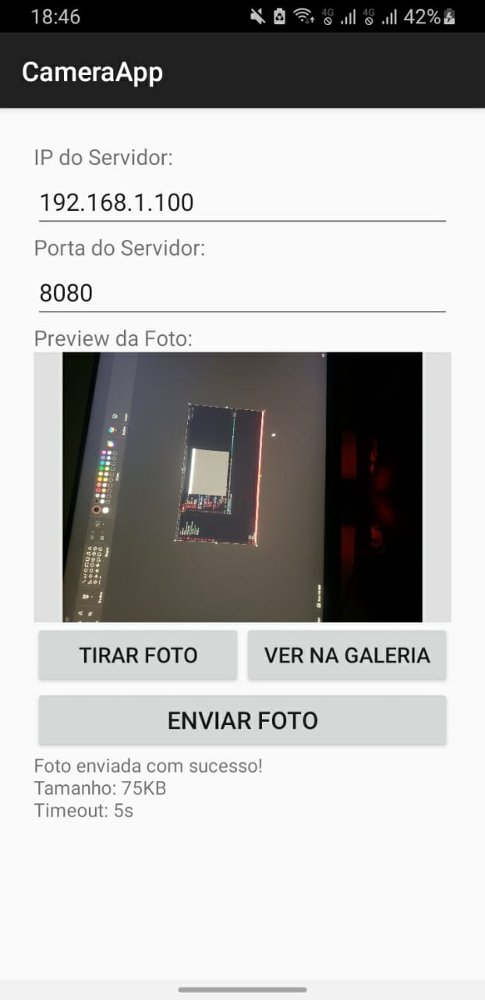
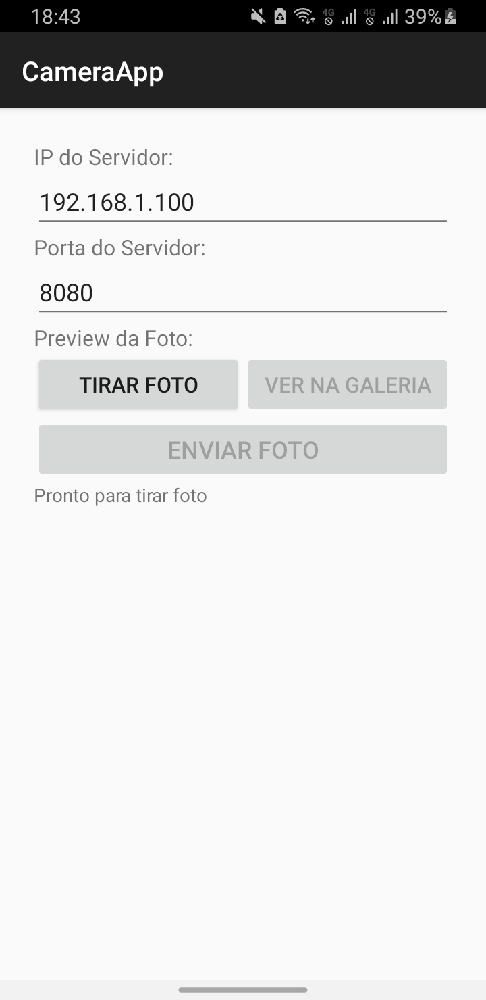
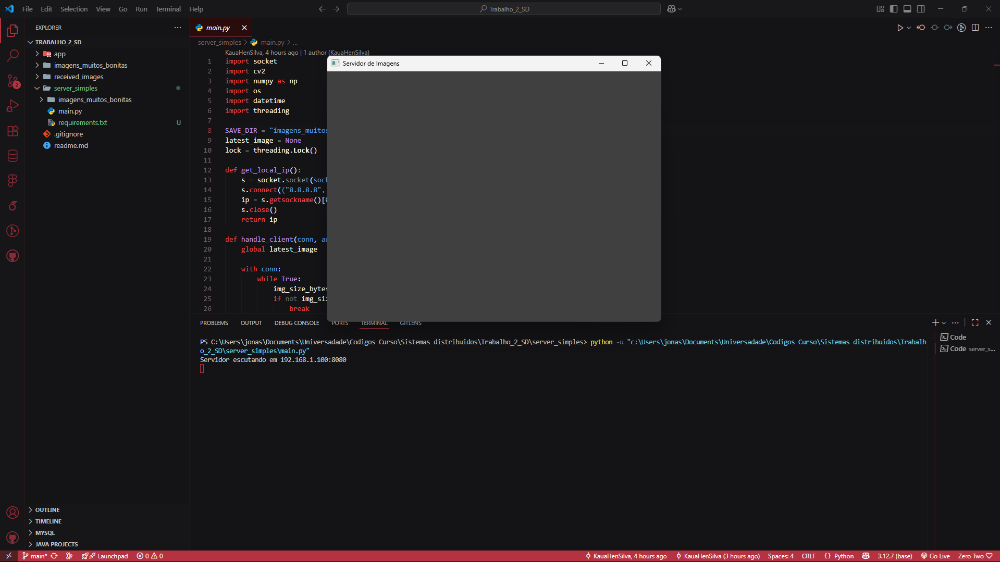

# 📸 Atividade 2 – Foto via Botão (Android → Servidor Python por Sockets)

Este projeto implementa um sistema simples de **captura e envio de fotos** de um aplicativo Android para um servidor Python usando **sockets TCP**.

---

## 🚀 Descrição

- O **app Android** permite tirar uma foto e enviá-la ao servidor.
- A **comunicação** segue um protocolo simples:
  - **4 bytes** iniciais → tamanho da imagem em bytes.
  - **N bytes seguintes** → conteúdo da foto em **JPEG**.
- O **servidor Python** recebe a foto, salva com **timestamp** em uma pasta e exibe a última imagem recebida em uma janela (se GUI disponível).

---

## 🛠️ Tecnologias Utilizadas

- **Android (Kotlin)**
  - [CameraX](https://developer.android.com/training/camerax) para captura de fotos
  - Envio de imagem via **socket TCP**
  - Interface nativa Android
- **Python 3**
  - `socket` → para comunicação TCP
  - `opencv-python` → para processamento e exibição das imagens
  - `numpy` → para manipulação de arrays de imagem
  - `threading` → para servidor multi-cliente
  - `os`, `datetime` → para salvar com timestamp

---

## 📋 Requisitos

### Android
- Android Studio Flamingo ou superior
- SDK Android 24+ (Android 7.0)
- Permissões de **Câmera** e **Internet** no `AndroidManifest.xml`
- Dispositivo físico ou emulador com câmera

### Python
- Python 3.8 ou superior
- Dependências (veja `requirements.txt`):
  ```txt
  opencv-contrib-python
  pillow
  ```

---

## ⚙️ Como Executar

### 1. 🐍 Servidor Python

1. **Clone o repositório:**
   ```bash
   git clone https://github.com/JonasCGN/Trabalho_2_SD.git
   cd Trabalho_2_SD/server_simples
   ```

2. **Instale as dependências:**
   ```bash
   pip install -r requirements.txt
   ```

3. **Execute o servidor:**
   ```bash
   python main.py
   ```

   **💡 Resolução de problemas OpenCV:**
   
   Se encontrar erro de GUI do OpenCV, execute:
   ```bash
   pip uninstall opencv-python opencv-contrib-python
   pip install opencv-python
   ```

   O servidor automaticamente detecta se a GUI está disponível:
   - ✅ **Com GUI**: Exibe janela com as imagens recebidas
   - 📝 **Sem GUI**: Roda em modo texto mostrando status

### 2. 📱 Aplicativo Android

#### **Opção 1: Instalar APK Pronto (Recomendado) 🚀**
*Para quem não quer instalar Android Studio/Java*

1. **Habilite instalação de fontes desconhecidas** no seu Android:
   - Configurações → Segurança → Fontes Desconhecidas ✅
   
2. **Transfira o APK para o dispositivo:**
   - Copie o arquivo `apk/app-debug.apk` para seu celular
   - Ou use ADB: `adb install apk/app-debug.apk`
   
3. **Instale tocando no arquivo APK** no gerenciador de arquivos

#### **Opção 2: Compilar no Android Studio**
1. Abra o Android Studio
2. Abra o projeto na pasta `app/`
3. Conecte um dispositivo Android via USB (com depuração habilitada) ou use emulador
4. Clique em **Run** (▶️) ou pressione `Shift+F10`

#### **Opção 3: Usando Makefile (linha de comando)**
1. **Navegue até a pasta do app:**
   ```bash
   cd app
   ```

2. **Gere o APK:**
   ```bash
   make gerar_apk
   ```
   
   Ou no Windows PowerShell:
   ```cmd
   .\gradlew assembleDebug
   ```

3. **Instale o APK no dispositivo:**
   ```bash
   make instalar_apk
   ```
   
   Ou manualmente:
   ```cmd
   adb install -r app/build/outputs/apk/debug/app-debug.apk
   ```

---

## 📱 Como Usar o App

1. **Configure o servidor:**
   - Insira o **IP do servidor** (exibido quando o servidor inicia)
   - Porta padrão: **8080**

2. **Tire e envie foto:**
   - Toque em **"Tirar Foto"** ou **"Câmera"**
   - Após capturar, toque em **"Enviar"**
   - A foto será enviada ao servidor automaticamente

3. **Verificar recebimento:**
   - No servidor: foto salva em `imagens_muitos_bonitas/`
   - Nome do arquivo: `img_YYYYMMDD_HHMMSS_IP.jpg`

---

## 📸 Screenshots

### Aplicativo Android

| Com Foto | Sem Foto |
|----------|----------|
|  |  |

### Servidor Python


---

## 🔧 Estrutura do Projeto

```
Trabalho_2_SD/
├── app/                          # Projeto Android
│   ├── src/main/kotlin/         # Código Kotlin
│   ├── src/main/res/            # Resources (layouts, etc)
│   ├── build.gradle.kts         # Configuração Gradle
│   └── makefile                 # Comandos para build
├── apk/                         # APK pronto para instalação
│   └── app-debug.apk           # Aplicativo compilado
├── server_simples/              # Servidor Python
│   ├── main.py                  # Código principal do servidor
│   └── requirements.txt         # Dependências Python
├── images/                      # Screenshots da documentação
├── imagens_muitos_bonitas/      # Pasta onde são salvas as fotos
└── README.md                    # Esta documentação
```

---

## 🚨 Troubleshooting

### Problema: OpenCV GUI não funciona
**Solução:** O código detecta automaticamente e roda em modo texto.

### Problema: App não conecta
**Verificar:**
- Servidor rodando na porta 8080
- IP correto (mesmo da rede)
- Firewall não bloqueando

### Problema: Erro de build Android
**Verificar:**
- Android SDK instalado
- Gradle sincronizado
- Dependências atualizadas

---